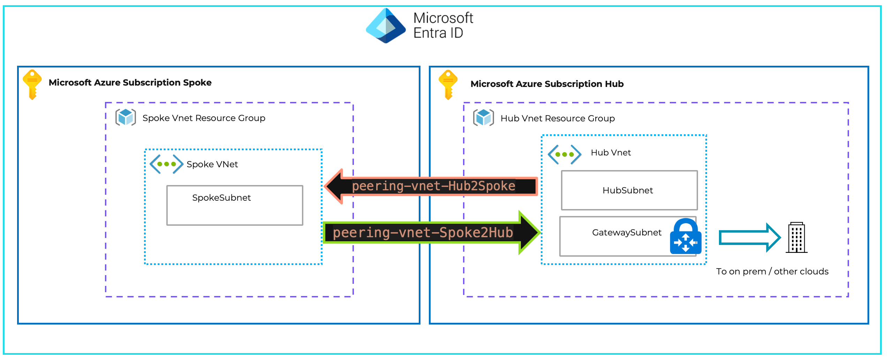

# AzureVnetPeering-2subs-1tenant

Terraform sample code to peer 2 Azure Virtual Networks in 2 different Azure Subscriptions in the same EntraID tenant

The sample is usefull If you have two Azure subscriptions attached to a single Microsoft EntraID Tenant (aka Azure Active Directory Tenant) with the Hub Vnet in one Azure subscription and a spoke VNet in a second subscription

You need have two different Service Principals (one per subscription but can be from the same AAD App Registration), each of them has access to one specific subscription only.

Both Service Principal should be assigned to a Azure Role that has the right permissions to do VNet Peering. [The Azure built-in role Network Contributor](https://learn.microsoft.com/en-us/azure/role-based-access-control/built-in-roles/networking#network-contributor) should work fine but you can also create your own custom role with just enough permissions

The diagram below shows a high-level architecture of this scenario :
 - a single EntraID Tenant (aka Azure AD Tenant)
 - 2 Azure Subscriptions (Sub-spoke and Sub-Hub)
 - 2 Virtual Network : A Hub VNet with a Gateway (VPN or ExpressRoute) and a Spoke VNet

 

More infos :
- Azure VNet peering : https://learn.microsoft.com/en-us/azure/virtual-network/virtual-network-peering-overview
- Hub and Spoke topology : https://learn.microsoft.com/en-us/azure/architecture/networking/architecture/hub-spoke 


## Step by step operations

Clone this repo, read the code and comments. 

Edit [configuration.tfvars](configuration.tfvars) to define your Azure resources (RG, VNet, Service Principal...).

1. Terraform Init phase  

```bash
terraform init
```

2. Terraform Plan phase

```bash
terraform plan --var-file=configuration.tfvars
```

3. Terraform deployment phase (add TF_LOG=info at the beginning of the following command line if you want to see what's happen during deployment)

```bash
terraform apply --var-file=configuration.tfvars
```

4. Wait until the end of deployment (It should be very quick)

5. If you want to remove the peering that was created

```bash
terraform destroy --var-file=configuration.tfvars
```
